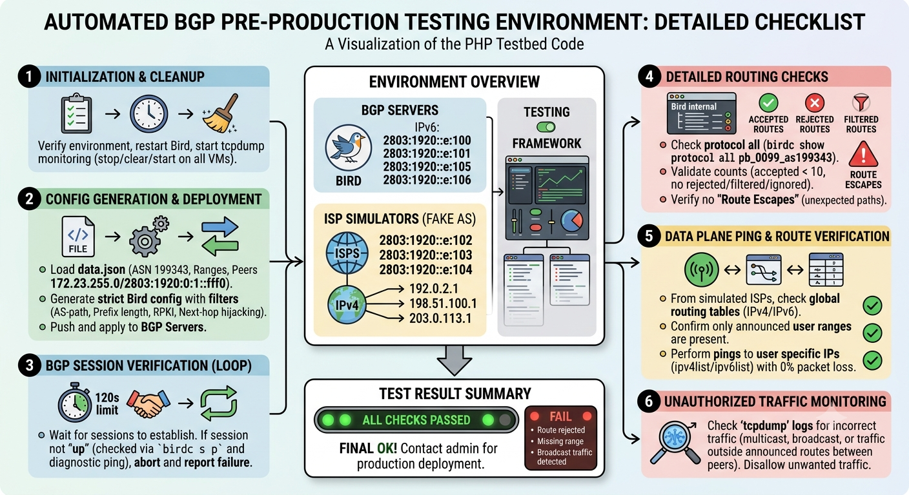

# IXP AS Validation



Automated validation tool for onboarding a new member AS (Autonomous System) onto an
IXP (Internet Exchange Point) route-server fabric. It stands up a sandbox of BIRD
route servers and fake-AS test VMs, configures the candidate peer, brings up its BGP
sessions, and runs a series of checks before the AS is promoted to production.

## How it works

The script (`validateAS.php`) is driven by a `data.json` file describing the
candidate member, then performs the following stages:

1. **Load & validate input** — reads `data.json` (ASN, name, peer IPs, announced
   prefix lists, test IPs) and validates every value (IP format, sanitized name,
   integer ASN) before it is interpolated into shell commands or BGP config.
2. **Reset sandbox** — restores every BIRD route server to its
   `bird.conf.template` baseline and restarts the `bird` service; waits until all
   existing BGP sessions settle (`up` / `Active`).
3. **Generate & deploy BGP config** — builds the per-AS BIRD stanza (tables,
   import/export filters with RPKI, AS-path, first-AS, next-hop hijack and prefix-
   length checks, import limit of 10) for both IPv4 and IPv6 route servers, ships it
   via `rsync`, restarts BIRD, and clears the BGP log.
4. **Wait for session establishment** — polls `birdc show protocols` for up to ~120s
   per route server until the new `pb_0099_as<ASN>` session is `up`.
5. **Route accounting** — reads `Import updates:` counters and fails on any
   rejected / filtered / ignored route, or more than 10 accepted routes.
6. **Route-leak detection** — verifies every accepted route originates from the
   expected `[AS<ASN>i]`; any other AS in the table is reported as a leak.
7. **Visibility & reachability from fake ASes** — from each fake-AS test VM, checks
   the kernel routing table shows exactly the announced v4/v6 prefix ranges (no
   missing, no extra), then pings each declared test IP via the fake-AS source
   address.
8. **Traffic capture** — runs `tcpdump` on every VM during the test; any non-BGP /
   non-ARP / out-of-prefix traffic (multicast, broadcast, leaks) fails the run.
9. **Final check & teardown** — re-verifies all BGP sessions are still healthy,
   stops the captures, and either reports an error or prints
   `todo los preubas estan OK, contactar el admin para pasar a production`.

## Input: `data.json`

```json
{
  "name": "NAME",
  "asn": 132456,
  "ipv4rangelist": [],
  "ipv6rangelist": ["2000::/48"],
  "ipv4list": [],
  "ipv6list": [],
  "peer4": "172.23.255.255",
  "peer6": "2803:1920:0:1::ffff"
}
```

| Field            | Description                                                  |
| ---------------- | ------------------------------------------------------------ |
| `name`           | Member display name (sanitized, `[A-Za-z0-9 ._-]` only).     |
| `asn`            | Member ASN (cast to int).                                    |
| `peer4`/`peer6`  | Member's BGP peering IPs on the IXP VLAN.                    |
| `ipv4rangelist` / `ipv6rangelist` | Announced prefix ranges to validate.          |
| `ipv4list` / `ipv6list`           | Individual test IPs to ping from the fake ASes. |

## Requirements

- PHP with `exec()` / SSH / `rsync` access.
- Password-less SSH (`root@`) to every route server and fake-AS VM.
- BIRD route servers exposing `/etc/bird/bird.conf.template`.
- `systemd` services: `bird`, `tcpdump`.

## License

See [LICENSE](LICENSE).
